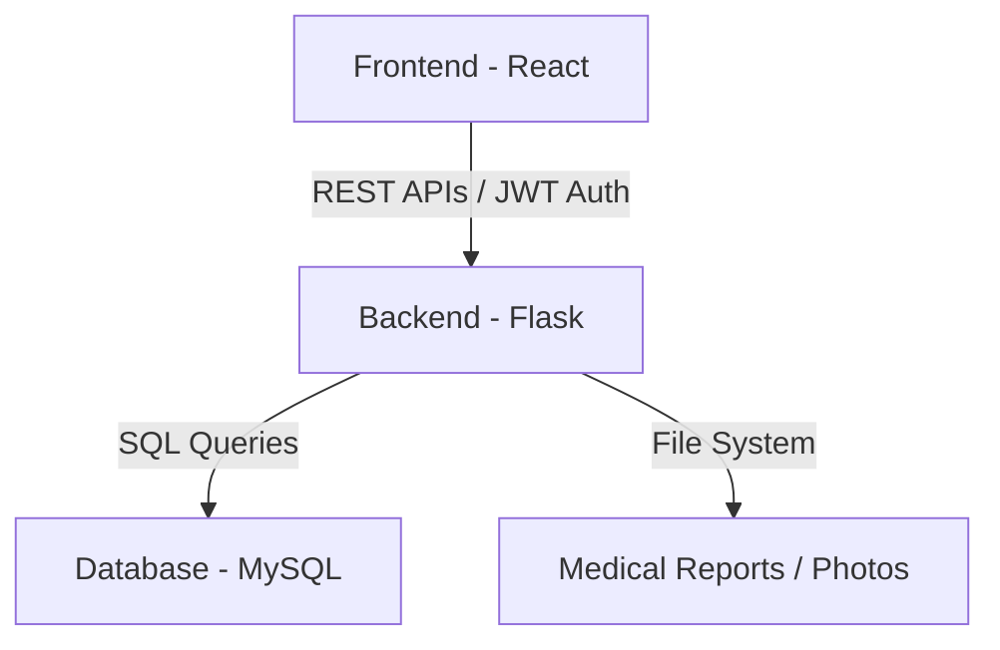

# 🏥 Healthcare Management System

**Doctor • Patient • Admin Platform**

A full-stack healthcare management system that enables seamless interaction between **Doctors**, **Patients**, and **Admins** through secure dashboards, appointment management, digital medical records, and analytics.

---

## 📌 Project Overview

This platform is designed to digitize and streamline healthcare operations by providing:

* **Doctors**: Efficient patient and appointment management tools.
* **Patients**: Easy access to consultations, prescriptions, and reports.
* **Admins**: Complete system control, analytics, and compliance tools.

The system follows a **modular, scalable architecture** suitable for clinics, hospitals, and telemedicine platforms.

---

## 🧱 System Architecture



---

## 🎯 Core Modules

### 🧑‍⚕️ Doctor Dashboard
- **Consultation Management**: Review approved appointments and patient history.
- **Clinical Records**: Save diagnoses, clinical notes, and interactive e-prescriptions.
- **Patient Registry**: Search and view patients under your care.
- **Availability**: Manage weekly working hours and time slots.
- **Billing**: Overview of consultation fees and earnings.

### 👤 Patient Dashboard
- **My Health Hub**: Quick Overview of upcoming visits and active prescriptions.
- **Appointments**: Real-time tracking of booking requests and consultation history.
- **Pharmacy**: Instant access to digital prescriptions issued by doctors.
- **Medical Reports**: Secure access to laboratory and radiology results.
- **Profile**: Manage personal contact information and health preferences.

### ⚙️ Admin Dashboard
- **System Stats**: KPI cards for doctors, patients, and total revenue.
- **Doctor Management**: Onboard new doctors and manage existing staff profiles.
- **Patient Control**: Full visibility into the patient registry.
- **Appointment Registry**: Approve, reassign, or delete booking requests.
- **Content Hub**: Manage hospital news, blogs, and public services.
- **Feedback Loop**: Monitor and respond to patient reviews.

---

## 🎨 Tech Stack

### Frontend
- **React.js**: Functional components with Hooks.
- **Tailwind CSS**: Premium, custom design system.
- **React Router**: Seamless SPAs routing.
- **Lucide Icons**: Modern iconography.

### Backend
- **Flask (Python)**: Robust RESTful API layer.
- **MySQL (PyMySQL)**: Relational database management.
- **Bcrypt**: Secure password hashing.
- **PyJWT**: Token-based authentication (JWT).

---

## 🚀 Getting Started

### Prerequisites
- Python 3.11+
- Node.js & NPM
- MySQL Server

### Backend Setup
```bash
cd backend
python3 -m venv venv
source venv/bin/activate
pip install -r requirements.txt
python3 app.py
```

### Frontend Setup
```bash
cd meddical-site
npm install
npm run dev
```

---

## 🔐 Test Accounts & Credentials

Use these pre-configured accounts to explore the system (Password for all is industry-standard for demo purposes).

| Role | Email | Password |
| :--- | :--- | :--- |
| **Admin** | `admin@gmail.com` | `Admin@123` |
| **Doctor** | `smith@hospital.com` | `Doctor@123` |
| **Patient** | `alice@example.com` | `Patient@123` |

---

## 🔐 Security & Compliance
- **JWT Authentication**: Secure sessions for all roles.
- **RBAC**: Role-Based Access Control ensuring users only see their relevant data.
- **Encrypted Passwords**: Industry-standard Bcrypt hashing.
- **Input Sanitization**: Protection against common web vulnerabilities.

---

## 👨‍💻 Development Team
Developed with ❤️ for Advanced Healthcare Delivery. 

---

# 📄 License
This project is licensed under the **MIT License**.
